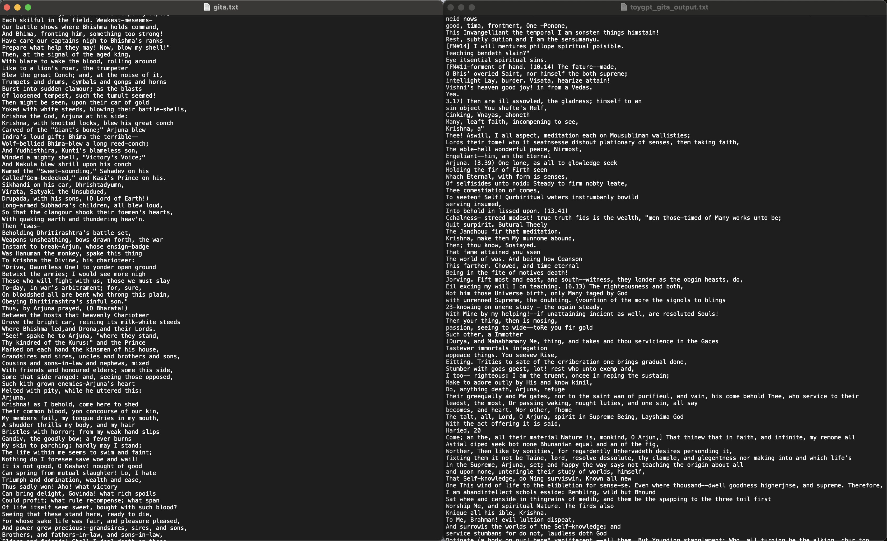

I have implemented a simple GPT(decoder only transformer) model using PyTorch, and trained it on a toy dataset of GITA. The model is trained to predict the next word in a sentence given the previous words.

### about files
- `toygpt.py`: Contains the implementation of the GPT model and training loop
- `gita.txt`: Contains the toy dataset of GITA
- `toygpt_nb.ipynb`: Jupyter notebook containing the code to train and evaluate the model(as I have trained the model on google colab(i am gpu poor lol))
- `toygpt_gita_output.txt`: Contains the generated text by the model

### additional information

1. I have trained a decoder only transformer for this task.
2. The model is trained on a toy dataset of GITA
3. The model is trained for 10000 epochs with a batch size of 16 and block size of 32
4. The model is able to generate coherent text that resembles the training data, but is not able to generate meaningful text beyond the training data.

### note :
- **It is a toy model and is not trained on a large dataset.**
- **The model can be further improved by training on a larger dataset and using a more sophisticated language modeling objective.**

### input and output difference

here is the image that shows the input(which the model is trained on) and output(the text generated from the model)

### resources I used

- [The Illustrated Transformer](http://jalammar.github.io/illustrated-transformer/)
- [Andrej's Zero to Hero series](https://youtube.com/playlist?list=PLAqhIrjkxbuWI23v9cThsA9GvCAUhRvKZ&si=gBtTDTyJv0WyMvk9)
- [Nano-GPT](https://github.com/karpathy/nanoGPT)
